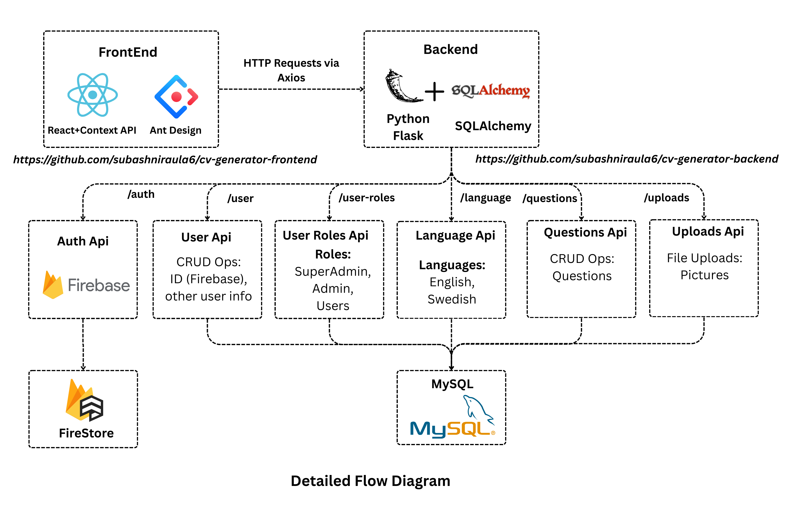

# 📄 CV Generator

An easy-to-use CV/Resume generator with a clean UI and robust backend.



---

## 🚀 Demo

👉 [Try it here](https://kneg.thebasanta.xyz)

## 📦 Backend Repository

👉 [cv-generator-backend](https://github.com/subashniraula6/cv-generator-backend)

---

## 🛠️ Project Setup

### 🔹 Frontend

1. **Install dependencies**

   ```bash
   npm install
   ```

2. **Copy environment variables template**

   ```bash
   cp .env-dev .env
   ```

3. **Update environment variables**

   * Set up a Firebase account
   * Add your Firebase API key and configuration to `.env`

4. **Run the project**

   ```bash
   npm start
   ```

✅ Your frontend is now running locally!

### 🔹 Backend

For backend setup instructions, head over to the backend repo:
👉 [cv-generator-backend](https://github.com/subashniraula6/cv-generator-backend)

---

## ✨ Features

* Generate professional CVs in minutes
* Firebase authentication integration
* Real-time data management
* Responsive and user-friendly interface

---

## 🤝 Contributing

Contributions are welcome! Feel free to open issues or submit PRs.

---

## 📄 License

This project is licensed under the **MIT License**.
